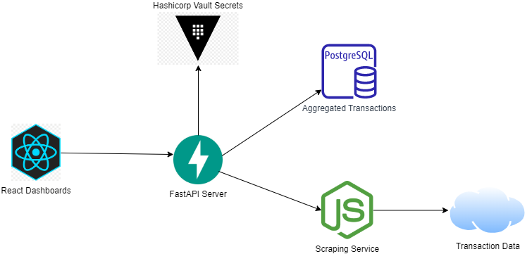

# FastAPI Budget DB (WIP)
A generalized api and Postgres DB to store financial transaction data from different data sources. 

## Design Details

API / DB:
- [FastAPI](https://fastapi.tiangolo.com/) server
- [SQLMODEL](https://sqlmodel.tiangolo.com/) ORM
- Containterized Postgres DB (or hosted in Neon / Supabase Postgres)

Scraper / Loader:
- Scraper implementation built using [Israel Bank Scrapers](https://github.com/eshaham/israeli-bank-scrapers) project. 
- Scraper can be additional docker container on a docker-compose monolith deployment, or extracted to a lambda.
- Scraper needs sensitive credentials, store securely at rest in a secrets manager.

Frontend:
- React GUI to consume and visualize data in pretty dashboards. Other typical consumers can be a Tableau client, PowerBI, ad-hoc Pandas scripts etc.

General Architecture:
